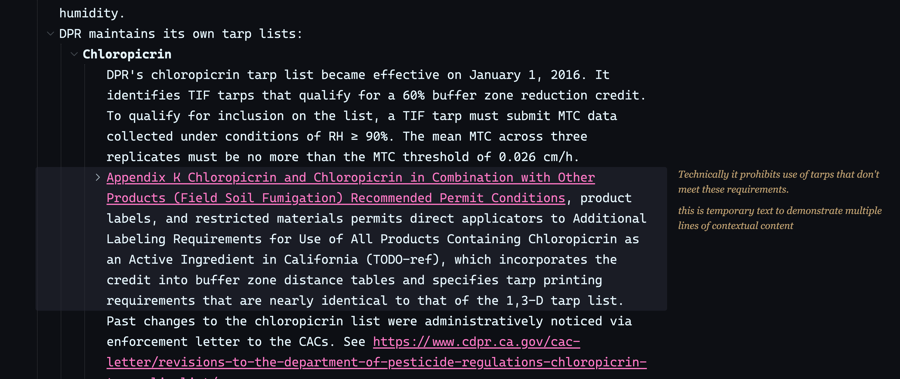
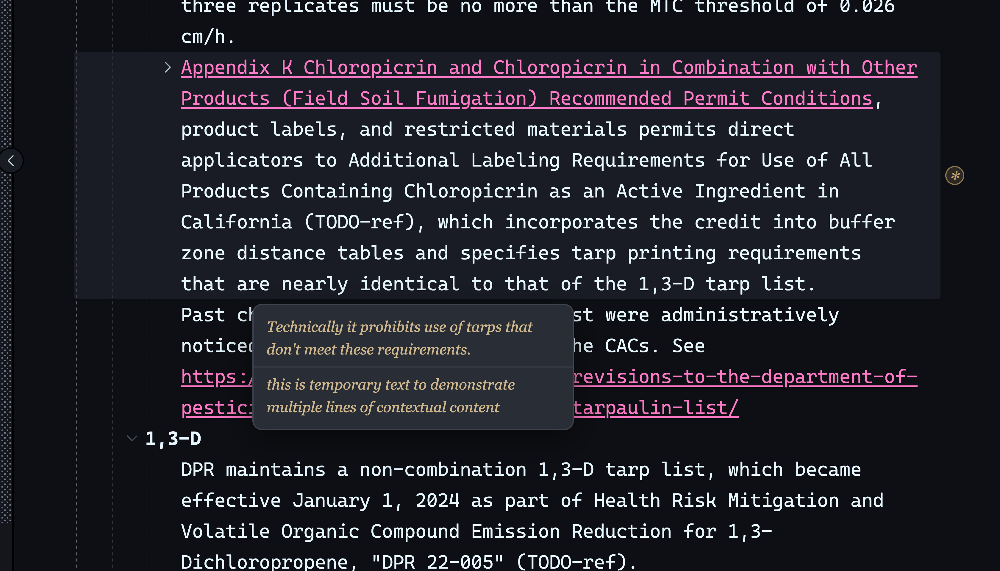

# Margin Notes

Tufte-style contextual content for [Thymer](https://thymer.com): attach a note to any
line and read it in the right margin, not in the outline.

A note is a real child line whose first segment is the `#ctx` hashtag — plain Thymer
content that syncs, searches, and survives the plugin being disabled. The plugin is
purely a different way of showing it:

- **Wide panel** (≥190px of free margin): notes render as serif sidenotes in the right
  margin, aligned to their line, pushing each other down when anchors are close.
- **Narrow panel**: annotated lines get a small ✻ glyph at their right edge; clicking
  it floats the note in a popover.
- **Expanded vs collapsed**: if a `#ctx` line is visible in the outline (its parent is
  expanded), the margin stays quiet and the line renders dimmed + italic instead — you
  never see a note twice. Collapse the parent and the sidenote comes back.



*Wide panel: notes render as sidenotes aligned to their line.*



*Narrow panel: one ✻ glyph per annotated line; clicking it stacks the line's notes in
a popover.*

## Usage

| Action | How |
|---|---|
| Add a note to a line | Add a child line, then `⌘P` → **Margin Notes: toggle #ctx on current line** — or type the child starting with `#ctx` |
| Edit a note | Click the sidenote (or open its popover, then click it) |
| Delete a note | Clear its text (leaves a bare `#ctx` line in the outline — delete that line yourself) |
| Turn a note back into normal content | Same palette command, cursor on the `#ctx` line |
| Hide/show all margin notes | Click **Margin Notes** in the status bar (per-device) |

The `#ctx` marker must be the line's first segment.

## Install

Copy `dist/plugin.js` (or build it: `./build.sh .`) into a global plugin's
**Edit Code → Custom Code**, and `plugin.json` into its Configuration. Or push from the
CLI:

```bash
./build.sh .
./bin/thymercli plugin update code "Margin Notes" --file dist/plugin.js -w <workspace-guid>
./bin/thymercli plugin update config "Margin Notes" --file plugin.json -w <workspace-guid>
```

Reload the client after pushing.

## How it works / safety

The editor DOM is never mutated. The plugin owns one overlay layer in `document.body`
and positions notes by *reading* row geometry (`.listitem[data-guid]`), refreshing on
scroll, resize, line-item events, and a periodic tick. The in-tree muting of expanded
`#ctx` lines is done with guid-targeted CSS rules only. If a Thymer release changes the
editor's markup, notes misplace or vanish — the data is untouched.

**Why doesn't clearing a note delete its line?** Thymer's undo stack only knows about
edits you make in the editor. If the plugin deleted the line and you later pressed
`⌘Z`, undo could replay an operation anchored to the missing line and crash the app
with an `EDITOR_TREE_CORRUPTION` error (your data survives — reload recovers — but
it's a hard stop). So the plugin only ever rewrites a line's *content*, never
adds, deletes, or moves lines. Clearing a note empties it to the bare `#ctx` marker,
and removing the line is left to you, in the outline, where undo can see it.

Built against the 0.0.18-era client (2026-08). Development notes and live-verified API
quirks are in `CLAUDE.md`.
